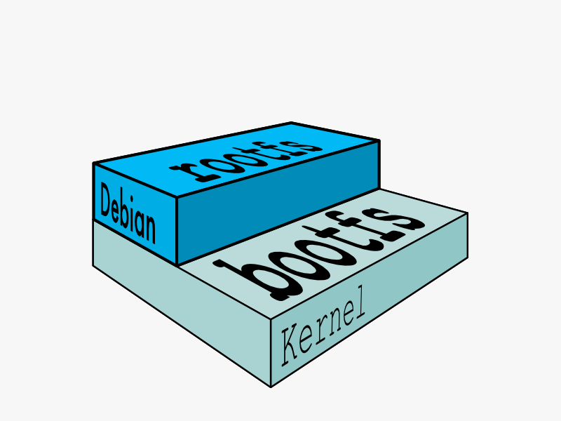
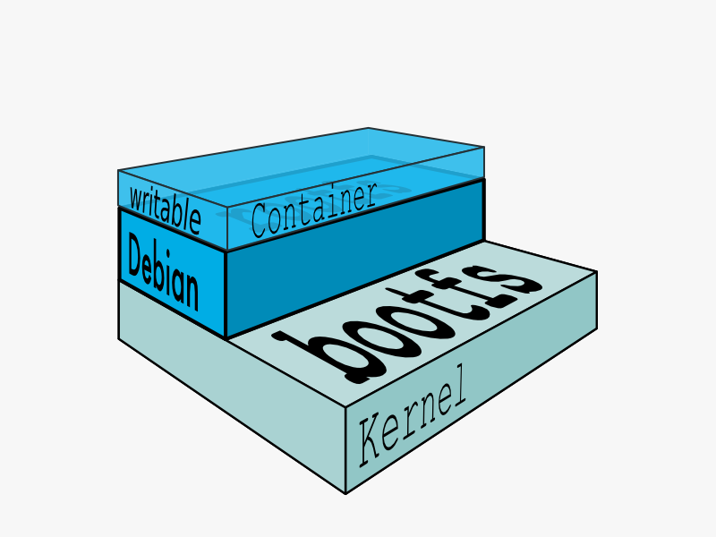
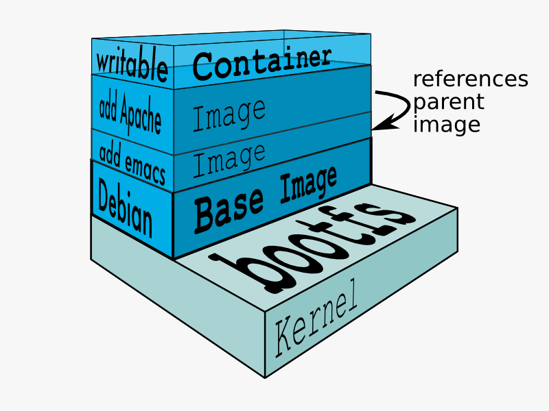

#镜像
## 介绍

在docker的术语中，一个只读的[分层](https://github.com/duanbing/docker-advance-feature/blob/master/docker%E5%88%86%E5%B1%82%E6%9E%B6%E6%9E%84.md)被称之为镜像(image)。一个镜像永远不会被改变。

因为docker使用[联合文件系统](https://github.com/duanbing/docker-advance-feature/blob/master/docker%E5%88%86%E5%B1%82%E6%9E%B6%E6%9E%84.md)，container进程会认为整个文件系统是可读写的。但是所有的修改都是在可写的上层。下层的所有文件都不会被修改。因此镜像是无状态的。

##父镜像

每个镜像都依赖低一层的镜像，我们就称下层的镜像是上层的父镜像。

##基本镜像
没有父镜像的镜像叫做基本镜像

##镜像ID
每个镜像都被唯一标记为64位的16进制字符串。为了简化这种使用方式，开始的12个字母被作为简化的id在命令行中使用。因为简化的id可能冲突，因此docker server总是返回完整的ID。
